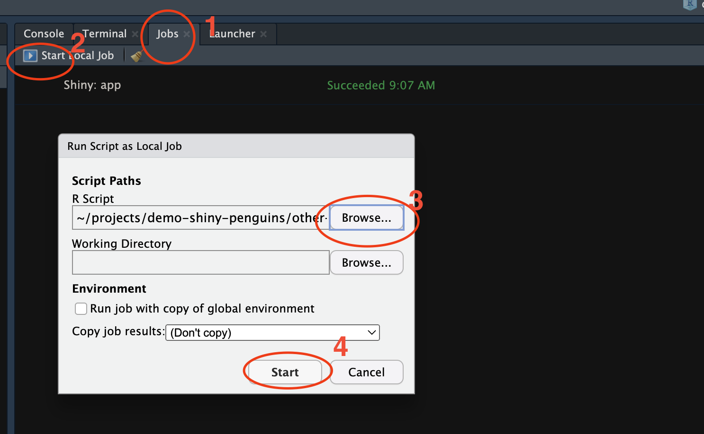
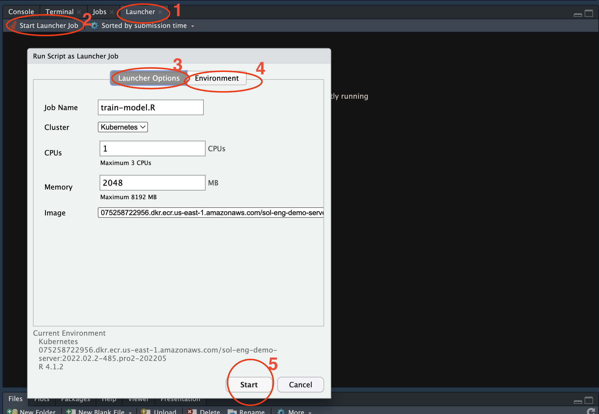

# other-cool-stuff

This directory contains examples of other RStudio Workbench features to demo.

## reticulate-example.Rmd

Demonstrate how to use R and Python in the same notebook using reticulate.

## train-model.R

This is a sample script that takes a few seconds to run. Demonstrate how you can use launcher to send this job outside of the current R session.

**Local Job**

**Launcher Job**

